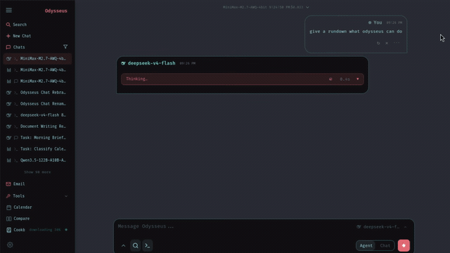
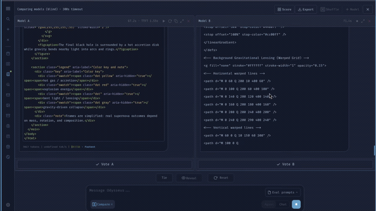
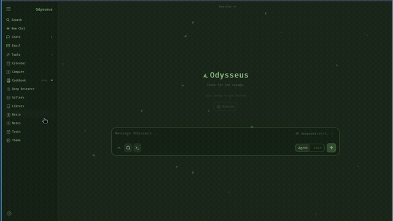

# Odysseus Lite

> **Fork note:** Odysseus Lite is a performance-focused fork of [Odysseus](https://github.com/pewdiepie-archdaemon/odysseus) for low-end PCs and laptops. Single container, CPU-first, no GPU required.

```
───────────────────────────────────────────────
 ⊹ ࣪ ˖ ૮( ˶ᵔ ᵕ ᵔ˶ )っ  Odysseus Lite vers. 1.0
───────────────────────────────────────────────
```


A lightweight, single-container, self-hosted AI workspace for low-end PCs and laptops. Built on Odysseus — trimmed, optimized, and CPU-first.

## Why Odysseus Lite?

Odysseus Lite is a fork of Odysseus designed for low-end PCs and laptops.
It removes heavy background services (ChromaDB, SearXNG, ntfy) and optional
features (Email, Calendar, Image Editor, Theme Editor) in favor of a single
container, lightweight memory via SQLite FTS5, and web search via DuckDuckGo.
The result: the full power of Chat, Agent, Shell, Deep Research, and Documents
— with a fraction of the resource usage.

Minimum recommended specs: 4GB RAM, any dual-core CPU, no GPU required.

## Features
  - **Chat** -- chat with any local model or API; adding them is super simple.<br>　<sub>vLLM · llama.cpp · Ollama · OpenRouter · OpenAI · GitHub Copilot</sub>
  - **Agent** -- hand it tools and let it run the whole task itself.<br>　<sub>built on [opencode](https://github.com/anomalyco/opencode) · MCP · web · files · shell · skills · memory</sub>
  - **Deep Research** -- multi-step runs that gather, read, and synthesize sources into a nice visual report.<br>　<sub>adapted from [Tongyi DeepResearch](https://github.com/Alibaba-NLP/DeepResearch)</sub>
  - **Compare** -- a fun tool to compare models side by side. Test completely blind, no bias!<br>　<sub>multi-model · blind test · synthesis</sub>
  - **Documents** -- YOU write the text, AI is there to assist, not the opposite.<br>　<sub>multi-tab editor · markdown · HTML · CSV · syntax highlighting · AI edits · suggestions</sub>
  - **Memory / Skills** -- Persistent memory and skills, your agent evolves over time!<br>　<sub>SQLite FTS5 + BM25 · keyword retrieval · import/export</sub>
  - **Notes & Tasks** -- Quick notes with reminders, a todo list, and scheduled tasks the agent can act on.<br>　<sub>note pings · checklist · cron-style tasks · browser notifications</sub>
  - **Agent Shell Tool** -- run shell commands, Python scripts, and MCP tools right from the agent.<br>　<sub>bash · Python · file read/write · background jobs</sub>
  - **Web Search** -- DuckDuckGo search built in, no external container needed.<br>　<sub>DuckDuckGo · no API key required</sub>
  - **Works on mobile** -- looks and runs great on your phone, not just desktop.<br>　<sub>responsive · installable (PWA) · touch gestures</sub>
  - **Security** -- 2FA, auth, API tokens, session management, and more.<br>　<sub>2FA · password auth · API tokens · session management</sub>

## Demo
A full, hover-to-play tour lives on the landing page (`docs/index.html`).

<details>
<summary>Screenshots / clips</summary>

### Chat & Agents

### Deep Research

### Compare

### Documents

### Notes & Tasks


</details>

## Quick Start

Defaults work out of the box: clone, run, then configure models and search
inside **Settings**. Only edit `.env` for deployment-level overrides like
`APP_BIND`, `APP_PORT`, `AUTH_ENABLED`, `DATABASE_URL`, or a pre-seeded admin password.

On first setup, Odysseus Lite creates an admin account (`admin` unless
`ODYSSEUS_ADMIN_USER` is set) and prints a temporary password in the terminal.
Use that for the first login, then change it in **Settings**.

### Docker (recommended)
```bash
git clone https://github.com/mcalexisc-png/odysseuslite.git
cd odysseuslite
docker compose -f docker-compose.lite.yml up -d --build
```

Open `http://localhost:7000` when the container is healthy. The single-container
setup binds the web UI to `127.0.0.1` by default. If the port is taken, set
`APP_PORT=7001` in `.env` and recreate the container. Set `APP_BIND=0.0.0.0`
only when you intentionally want LAN/reverse-proxy access.

> **First login:** See [🔑 First Login — Finding Your Admin Password](#-first-login--finding-your-admin-password) below to retrieve your temporary admin password from the container logs.

### Native Linux / macOS
```bash
git clone https://github.com/mcalexisc-png/odysseuslite.git
cd odysseuslite
python3 -m venv venv
source venv/bin/activate
pip install -r requirements.lite.txt
python setup.py
export LITE_MODE=true
python -m uvicorn app:app --host 127.0.0.1 --port 7000
```
Requirements: Python 3.11+. The app is lightweight; local model serving depends
on the model, runtime, and hardware. Small hosts can connect to API or remote
model servers instead. Use `--host 0.0.0.0` only when you intentionally want
LAN/reverse-proxy access. `LITE_MODE=true` is what disables Email/Calendar/Image
Editor/Theme Editor — `./start-macos.sh` and `launch-windows.ps1` already default
it on; this manual venv path is the one case where you set it yourself (or put
it in `.env`, which `uvicorn` reads automatically via `python-dotenv`).

> **First login:** Look for the admin password block in the terminal output. See [🔑 First Login — Finding Your Admin Password](#-first-login--finding-your-admin-password) for details.

### macOS
```bash
git clone https://github.com/mcalexisc-png/odysseuslite.git
cd odysseuslite
./start-macos.sh
```

It launches at `http://127.0.0.1:7860`. The script also reads `.env` at startup,
so `APP_BIND=0.0.0.0` and `APP_PORT` set there are picked up automatically.

> **First login:** The temporary admin password is printed in the terminal. See [🔑 First Login — Finding Your Admin Password](#-first-login--finding-your-admin-password) for details.

### Native Windows
```powershell
git clone https://github.com/mcalexisc-png/odysseuslite.git
cd odysseuslite
powershell -ExecutionPolicy Bypass -File .\launch-windows.ps1
```

Or do it by hand:
```powershell
git clone https://github.com/mcalexisc-png/odysseuslite.git
cd odysseuslite
py -3.11 -m venv venv
venv\Scripts\Activate.ps1
pip install -r requirements.lite.txt
python setup.py
$env:LITE_MODE = "true"
python -m uvicorn app:app --host 127.0.0.1 --port 7000
```

Open `http://localhost:7000`, log in with the generated admin password,
and configure everything inside **Settings**.

> **First login:** The temporary admin password is printed in the PowerShell window. See [🔑 First Login — Finding Your Admin Password](#-first-login--finding-your-admin-password) for details.

## 🧠 Choosing a Model — and What to Expect on Low-End Hardware

"Runs on 4GB, no GPU" describes the *app*, not a magic fast AI. The model you run
decides quality and speed. The **Lite Cookbook** (first run + Settings) detects
your RAM/CPU and recommends a small, CPU-friendly quantized model — no 270-model
scan, just a concrete pick. You can also hit it directly:

```bash
curl http://localhost:7000/api/lite/cookbook/recommend
```

Honest, CPU-only (no GPU) expectations — your mileage varies with CPU and quant:

| Your RAM | Tier | Sensible default | Rough speed | Good for |
|---|---|---|---|---|
| 2–4 GB | minimal | `llama3.2:1b` (Q4) | ~3–10 tok/s | simple Q&A, drafting, tool calls — not long reasoning |
| 4–8 GB | **balanced** (sweet spot) | `llama3.2:3b` (Q4) | ~5–15 tok/s | usable chat, summaries, agent tool use |
| 8 GB+ | comfortable | `llama3.1:8b` (Q4) | ~4–12 tok/s | best local reasoning + longer context, slower per token |

These run via **[Ollama](https://ollama.com)** (start it on the host, then point
Odysseus at it). To let the app pull a sensible default for you on first run,
set `LITE_AUTOPULL_MODEL=true` — it still asks before downloading, and never
downloads silently. If no local model is comfortable on your machine, use
**API mode** instead (OpenAI / OpenRouter): set the key in Settings or `.env`
and pick a small, cheap model like `gpt-4o-mini`. The Lite Cookbook screen links
both paths.

## 🔑 First Login — Finding Your Admin Password

On the very first boot, Odysseus Lite automatically creates an admin account and
generates a **one-time temporary password**. You must retrieve this password from
the logs to log in for the first time. **It is only shown once at startup.**

The default admin username is `admin` (or whatever you set `ODYSSEUS_ADMIN_USER`
to in `.env` before first boot).

---

### 🐳 Docker — `docker-compose.lite.yml`

After running `docker compose -f docker-compose.lite.yml up -d --build`, retrieve
the temporary password from the container logs:

```bash
docker compose -f docker-compose.lite.yml logs odysseus | grep -i "password"
```

Or scroll the full startup log:

```bash
docker compose -f docker-compose.lite.yml logs odysseus
```

Look for a line that reads something like:

```
odysseus  | ──────────────────────────────────────────
odysseus  |  Admin account created
odysseus  |  Username : admin
odysseus  |  Password : aBcDeFgH1234  ← this is your temporary password
odysseus  | ──────────────────────────────────────────
```

Copy the password and use it to log in at `http://localhost:7000`.

---

### 🐧 Native Linux / macOS

When you run the app natively, the temporary password is printed directly in the
terminal window:

```bash
python -m uvicorn app:app --host 127.0.0.1 --port 7000
```

Watch the output for the admin password block — it appears in the first few
seconds of startup, before the server begins accepting requests.

If you used `start-macos.sh`, the password is in that same terminal window.

---

### 🍎 macOS — `start-macos.sh`

```bash
./start-macos.sh
```

The temporary password is printed to the terminal window where you ran the
script. Look for the admin password block in the startup output.

The app starts on port `7860` on macOS (not `7000`), so open:
`http://127.0.0.1:7860`

---

### 🪟 Native Windows — `launch-windows.ps1`

```powershell
powershell -ExecutionPolicy Bypass -File .\launch-windows.ps1
```

The temporary password is printed in the **PowerShell window** where you ran the
script. Look for the admin password block in the startup output. Open
`http://localhost:7000` after the server starts.

---

### ✏️ After Your First Login

Once you are logged in with the temporary password:

1. Go to **Settings → Account**
2. Change your password to something secure
3. Optionally rename the admin account or add more users

---

### 🔁 Forgot Your Password / Need to Reset

If you missed the temporary password or are locked out, **reset just the
password — you do NOT need to wipe the database.** This keeps all users, chats,
and settings intact.

**Native (Linux / macOS / Windows):**
```bash
# Reset the first admin's password (prompts, or pass --password):
python setup.py reset-password
# Or a specific user with an explicit password:
python setup.py reset-password admin --password "your-new-password"
```
With no password given (and no TTY), a strong random one is generated and
printed once. Log in, then change it under **Settings**.

**Docker:**
```bash
docker compose -f docker-compose.lite.yml exec odysseus python setup.py reset-password
```

<details>
<summary>Last resort: full wipe (deletes all users, chats, and settings)</summary>

Only if `reset-password` can't help (e.g. the auth file is corrupt):

```bash
# Native:
rm -f data/app.db data/auth.json
python -m uvicorn app:app --host 127.0.0.1 --port 7000
# Docker:
docker compose -f docker-compose.lite.yml down
rm -f data/app.db data/auth.json
docker compose -f docker-compose.lite.yml up -d
docker compose -f docker-compose.lite.yml logs odysseus | grep -i "password"
```
A new temporary password is printed at startup.
</details>

---

### ⚙️ Pre-Setting the Admin Username (Optional)

To use a custom admin username instead of `admin`, set `ODYSSEUS_ADMIN_USER` in
your `.env` file **before the very first boot**:

```bash
# .env
ODYSSEUS_ADMIN_USER=yourname
```

This has no effect after the first boot (the account is already created).

## Troubleshooting & Advanced Setup

### HTTPS + LAN/Tailscale exposure
To expose Odysseus Lite on a local network or Tailscale with HTTPS:
1. Change the bind address to `0.0.0.0` in `.env` (`APP_BIND=0.0.0.0`).
2. Generate a locally-trusted cert for your LAN/Tailscale IPs using [mkcert](https://github.com/FiloSottile/mkcert):
   ```bash
   mkcert -install
   mkcert -cert-file cert.pem -key-file key.pem 192.168.1.100 tailscale-ip
   ```
3. Run `uvicorn` with the generated certs:
   ```bash
   python -m uvicorn app:app --host 0.0.0.0 --port 7000 --ssl-certfile=cert.pem --ssl-keyfile=key.pem
   ```
4. Install the `mkcert` CA on any other device you want to access Odysseus Lite from.

### Optional Dependencies
`requirements-optional.txt` contains packages that unlock extra features. It is not installed by default.

| Package | Feature unlocked |
|---------|-----------------|
| `faster-whisper` | Local speech-to-text (microphone -> text) via the "local" STT provider. |
| `PyMuPDF` | PDF page rendering in the side viewer panel and form-filling. (Note: AGPL-3.0) |
| `markitdown` | Office/EPUB document text extraction (converts .docx/.xlsx/.pptx/.xls/.epub to Markdown). |

## Security Notes
Odysseus Lite is a self-hosted workspace with powerful local tools: shell access, file uploads, web research, and API tokens. Treat it like an admin console.

- Keep `AUTH_ENABLED=true` for any network-accessible deployment.
- Keep `LOCALHOST_BYPASS=false` outside local development.
- Use `SECURE_COOKIES=true` when Odysseus Lite is served through HTTPS by a trusted reverse proxy or private access gateway.
- Do not expose it directly to the public internet without HTTPS and a trusted reverse proxy or private access layer.
- Keep `.env`, `data/`, `logs/`, databases, uploads, generated media, backups, auth/session files, API keys, and model/provider tokens out of Git and private shares. They are ignored by default.
- Review `data/auth.json` after first boot: disable open signup unless you intentionally want it, make only your own account admin, and keep demo/test accounts non-admin.
- Non-admin users do not get shell/Python/file read/write by default, and admin-only routes/tools such as MCP management, API tokens, webhooks, model/cookbook serving, backup/vault, and app settings are admin-gated.
- Prefer binding manual development runs to `127.0.0.1`; bind to `0.0.0.0` only when you intentionally want LAN/reverse-proxy access.
- Before publishing a fork, run `git status --short` and confirm no private files from `.env`, `data/`, `logs/`, uploads, backups, or local databases are staged.

### Private or proxied deployments
A typical private setup:

1. Keep Odysseus Lite on localhost, for example `127.0.0.1:7000`.
2. Terminate HTTPS at a trusted reverse proxy or private access gateway.
3. Put the authenticated web/API entrypoint behind that layer.

Cloudflare Access, Tailscale, Caddy, nginx, and Traefik can all fit this pattern.

Common internal-only ports:

| Port | Service |
|---|---|
| `7000` | Odysseus Lite app port |
| `11434` | Ollama |
| `8000-8020` | Common local model/provider APIs |

## Giving the agent access to your files

By default the agent **cannot reach files on your computer** — it only sees the
app's own `data/` directory. You can opt in to sharing a single folder. This is
off until you explicitly enable it, and read-only is the default.

### Read-only (recommended)

1. In `.env`, set the folder you want to share:
   ```
   HOST_FS_PATH=/home/youruser/Documents
   ```
   (Leave `HOST_FS_MODE` unset or `ro`.)
2. Restart: `docker compose -f docker-compose.lite.yml up -d`. The folder now
   appears inside the container at `/host`.
3. In the chat UI, open the **workspace picker** (the folder icon in the input
   bar's overflow menu) and click **Shared folder (/host)**, then **Use this
   folder**.
4. Ask the agent to read/list/search files. It can read but not modify them.

Confirm the mode anytime in **Settings → File Access**.

### Read-write (higher risk)

This lets the agent **and any prompt injection it encounters** (in a document it
reads or a web result) modify or delete real files in the shared folder. Only do
this on a trusted machine. In `.env`:

```
HOST_FS_PATH=/home/youruser/Projects
HOST_FS_MODE=rw
AGENT_SHELL_MODE=unrestricted
AGENT_SHELL_ACK_UNSAFE=true
```

Restart. A loud warning is logged at startup and **Settings → File Access** shows
**Read-write** with a warning banner.

### Safety model

- **Default-off.** No host folder is mounted unless you set `HOST_FS_PATH`.
- **Folder scope.** The agent's file tools are jailed to the folder you pick via
  the workspace picker — not the whole disk.
- **Sensitive-file denylist.** `.ssh`, `.gnupg`, key files (`id_rsa`, …), and
  shell rc files are blocked **in every mode**, even inside a shared folder.
- **Honest trade-off.** Read-only keeps the shell sandboxed and your files
  unmodifiable. Read-write removes the shell sandbox; treat it like handing the
  agent your own user account for that folder.

## Configuration
Most setup is done inside the app with **Settings**. Use `.env`
for deployment-level defaults and secrets you want present before first boot.
Key settings:

| Variable | Default | Description |
|---|---|---|
| `LITE_MODE` | `true` | Enables Lite mode (disables Email, Calendar, Image Editor, Theme Editor) |
| `MEMORY_BACKEND` | `sqlite_fts` | Memory backend: `sqlite_fts` or `chromadb` |
| `SEARCH_PROVIDER` | `duckduckgo` | Search provider: `duckduckgo` or `searxng` |
| `CHROMADB_ENABLED` | `false` | Enable ChromaDB vector memory (requires a ChromaDB server) |
| `LLM_HOST` | `localhost` | Your LLM server (e.g. `llm-host.local:8000`) |
| `LLM_HOSTS` | -- | Comma-separated list for model discovery |
| `OPENAI_API_KEY` | -- | Optional OpenAI key |
| `APP_BIND` | `127.0.0.1` | Host bind address for the web UI |
| `APP_PORT` | `7000` | Host port for the web UI |
| `AUTH_ENABLED` | `true` | Enable/disable login |
| `LOCALHOST_BYPASS` | `false` | Dev-only auth bypass for loopback requests |
| `SECURE_COOKIES` | `false` | Set true when serving through HTTPS |
| `DATABASE_URL` | `sqlite:///./data/app.db` | Database connection string |
| `RESEARCH_MAX_STEPS` | `5` | Max steps for Deep Research runs |
| `RESEARCH_CONCURRENCY` | `1` | Max parallel fetches in Deep Research |
| `ODYSSEUS_CHAT_UPLOAD_MAX_BYTES` | `5242880` | Chat/agent attachment cap in bytes (5 MB default for Lite) |
| `HOST_FS_PATH` | -- | Opt-in: a host folder to share with the agent at `/host` (unset = no host access). See "Giving the agent access to your files" |
| `HOST_FS_MODE` | `ro` | Mount mode for `HOST_FS_PATH`: `ro` (read-only) or `rw` (read-write; also needs `AGENT_SHELL_MODE=unrestricted`) |

All upload-limit vars are validated (must be a positive integer) and optional; an invalid value fails fast at startup.

### Built-in MCP servers (optional setup)

Odysseus Lite auto-registers a few built-in MCP servers at startup. The npx-based ones (currently the browser server, `@playwright/mcp`) only start when their npm package is already in the local npx cache.

To enable the browser MCP (page navigation, screenshots, vision), run once:

```bash
npx -y @playwright/mcp@latest --version
```

That installs `@playwright/mcp` plus Playwright (~300MB total). Restart Odysseus Lite and the server will register at startup.

## Architecture
```
app.py                                 # FastAPI entry point
core/      auth, database, middleware, constants
src/       llm_core, agent_loop, agent_tools, chat_processor, search/
routes/    chat, session, document, memory, model … endpoints
services/  search/ (DuckDuckGo + fallback chain), memory_hybrid, cookbook_lite, docs …
static/    index.html + app.js + style.css + js/ (modular front-end)
```

## Data
All user data lives in `data/` (gitignored): `app.db` (sessions, messages, documents),
`memory_fts.db` (FTS5 memory), `presets.json`, `uploads/`, `personal_docs/`, `settings.json`.

## License
AGPL-3.0-or-later -- see [LICENSE](LICENSE) and [ACKNOWLEDGMENTS.md](ACKNOWLEDGMENTS.md).

```
                                  |
                                 |||
                                |||||
                  |    |    |   |||||||
                 )_)  )_)  )_)   ~|~
                )___))___))___)\  |
               )____)____)_____)\\|
             _____|____|____|_____\\\__
             \                       /
       ~^~^~~^~^~~^~^~~^~^~~^~^~~^~^~~^~^~~^~^~
               ~^~  all aboard!  ~^~
       ~^~^~~^~^~~^~^~~^~^~~^~^~~^~^~~^~^~~^~^~
```
